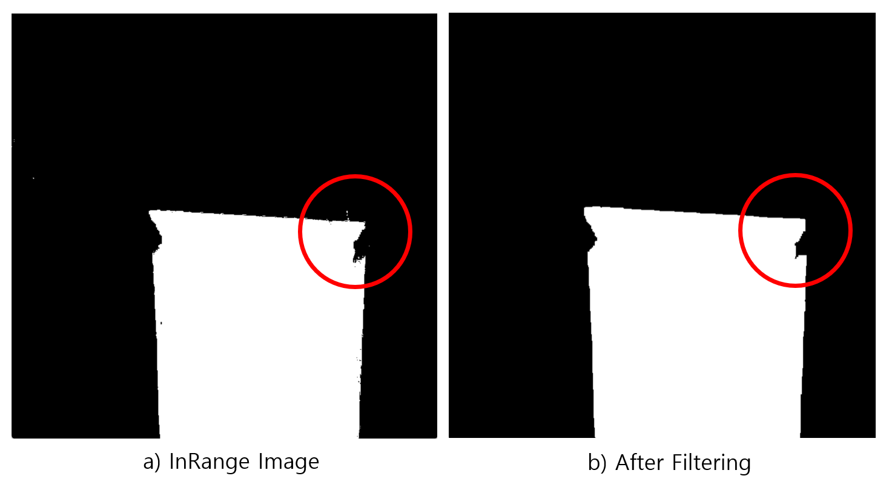

# LAB: Magic Cloak


**Date:**  2025-April-18

**Author:**  Chanjung Kim  22000188

**Github:**  [Github_CJ](https://github.com/Chanjung-K/DLIP/tree/main/LAB/Magic%20Cloak)

**Demo Video:** [YouTube](https://youtu.be/nXw_Ptiz_zI)

---


# Introduction
## 1. Objective
​	The goal of this project is to create a basic OpenCV program that makes a person wearing a cloak appear invisible. This is done by detecting the cloak based on its color and replacing it with the background image, so it looks like the person disappears.

​	The program uses simple image processing techniques like color detection, masking, and background subtraction to achieve this visual effect. This project helps demonstrate how computer vision can be used to create optical illusions and can be a starting point for more advanced augmented reality systems.

**Goal**: Invisible Cloak

<hr>

## 2. Preparation

### Software Installation

- OpenCV 4.11
-  Visual Studio 2022
-  [DLIP_LAB.h](https://github.com/Chanjung-K/DLIP/tree/main/LAB/Magic%20Cloak/src/include)

### Video Samples

​	Two video samples are used in this lab to demonstrate an invisible cloak. Two videos can be downloaded by links provided below.

**Sample #1:** [Download](https://github.com/Chanjung-K/DLIP/blob/main/LAB/Magic%20Cloak/report/img/LAB_MagicCloak_Sample1.mp4)

**Sample #2:** [Download](https://github.com/Chanjung-K/DLIP/blob/main/LAB/Magic%20Cloak/report/img/Sample2.mp4)

<hr>


# Algorithm

​	In this section, an overview and detailed procedure of the algorithm used to implement the invisible cloak are introduced.

## 1. Overview

​	The algorithm begins by defining a reference color, which is then used to compute the mean and variation of hue, saturation, and value (HSV). Based on these values, a suitable HSV range is selected. The first frame of the video is captured and stored as a reference background image. While the video is playing, each frame follows an algorithm to detect the reference cloak color. The detected regions are masked and replaced with the background, creating the illusion of invisibility.

<figure style = "text-align : Center">
	
    <figCaption style = "text-align : center; font-size:20px"><b>Figure 1. Alogorithm Overview</b></figCaption>
</figure>

<hr>


## 2. Procedure

​	This section describes the key steps of the algorithm in detail, including HSV range selection, masking, morphological filtering, and bitwise operations.

### 2-1. Selection of HSV range

​	To detect the cloak reliably, the HSV color space is used instead of the BGR space, as it is more robust to lighting variations. The user provides a reference image or color sample, which is converted from BGR to HSV. From this converted image, the HSV range (minimum and maximum values) is determined and fine-tuned.

<figure style = "text-align : Center">
        
    <figCaption style = "text-align : center; font-size:20px"><b>Figure 2. Reference Image</b></figCaption>
</figure>

​	The selected HSV range is printed in the terminal for verification, as shown in **Figure 3** below.

<figure style = "text-align : Center">
        
    <figCaption style = "text-align : center; font-size:20px"><b>Figure 3. Terminal Screen</b></figCaption>
</figure>


<hr>

### 2-2. InRange function

​	OpenCV provides the `inRange()` function, which checks whether each pixel's HSV value falls within the specified minimum and maximum range. Pixels within the range are marked in a binary mask (value 1 or 0), effectively isolating the color of the cloak as shown in **Figure 4** below.

<figure style = "text-align : Center">
        
    <figCaption style = "text-align : center; font-size:20px"><b>Figure 4. InRange Effect</b></figCaption>
</figure>


<hr>

### 2-3. Morphology filtering

​	After masking, morphological operations are applied to remove noise and fill in gaps. An opening operation is used first to eliminate small noise particles, followed by a closing operation to fill small holes in the detected region. This helps in accurately identifying the cloak area as a whole. The red circles in **Figure 5** below are drawn to help a reader to easily find out its effects.

<figure style = "text-align : Center">
        
    <figCaption style = "text-align : center; font-size:20px"><b>Figure 5. Filter Effect</b></figCaption>
</figure>


<hr>

### 2-4. Bitwise Operation

​	The `Mat` class in OpenCV supports bitwise operations that help merge the mask with the background and foreground images. The masked region is extracted from the background, while the inverse mask is applied to the current frame to retain non-cloak areas.

```c++
dst = back & temp;
bitwise_not(temp, temp);
src = src & temp;
dst = src + dst;
```

​	Two images are added to produce the final output frame, which are shown in **Figure 6**.

<figure style = "text-align : Center">
        
    <figCaption style = "text-align : center; font-size:20px"><b>Figure 6. Bitwise Operation Result</b></figCaption>
</figure>


<hr>

# Result and Discussion

​	This section presents the results obtained from two sample videos and provides a brief discussion regarding the output and observed behavior of the algorithm.

### 1. Result

​	The result of first sample is shown in **Video 1** below. If the video does not appear, please refer to following [link](img/Output1.mp4) to view a video.

<figure style = "text-align : Center">
    	<video controls width = "720"> 
            <source src = "img/Output1.mp4" type = "video/mp4">
		</video>
    	<figCaption style = "text-align : center; font-size:16px"><b>Video 1. Sample #1</b></figCaption>
</figure>
​	Similarly, the second video sample is presented in **Video 2**. If the video does not appear, please refer to following [link](img/Output2.mp4) to view a video.

<figure style = "text-align : Center">
    	<video controls width = "720"> 
            <source src = "img/Output2.mp4" type = "video/mp4">
		</video>
    	<figCaption style = "text-align : center; font-size:16px"><b>Video 2. Sample #2</b></figCaption>
</figure>
​	Additionally, the calculated minimum and maximum HSV ranges used for color detection are displayed in the terminal window. These values, shown in **Figure 7**, were used to define the range of the cloak color for masking and replacement with the background.

<figure style = "text-align : Center">
        
    <figCaption style = "text-align : center; font-size:20px"><b>Figure 7. HSV Range</b></figCaption>
</figure>


<hr>

### 2. Discussion

​	This experiment aimed to segment a specific color, apply a mask, and generate a visual effect similar to a magic cloak. The implemented algorithm demonstrated robust performance in the first video sample, where the cloak effect was accurately realized. However, in the second sample, some detection issues were observed, indicating room for improvement in specific conditions.

​	One major issue arose when light was reflected by the cloak object, specifically a smartphone. As shown in **Figure 8**, light reflections caused the cloak's surface to diverge from the expected color range, leading to inaccurate masking and reduced performance.

<figure style = "text-align : Center">
        
        <figCaption style = "text-align : center; font-size:20px"><b>Figure 8. Detection Issue</b></figCaption>
</figure>

​	Analysis of the HSV values in the problematic area, presented in **Figure 9**, reveals that the reflected regions fall below the minimum saturation threshold defined in the algorithm. This difference suggests that light reflections significantly change the detected color space, highlighting the need for more advanced filtering or adaptive detection strategies.

<figure style = "text-align : Center">
        
        <figCaption style = "text-align : center; font-size:20px"><b>Figure 9. HSV Range</b></figCaption>
</figure>

​	Despite the limitations observed under reflective conditions, the overall performance of the proposed algorithm successfully achieved the primary objective of the experiment, which is creating a working prototype of a "magic cloak" effect through color segmentation and background substitution.

<hr>

# Conclusion

​	The purpose of this lab was to implement a basic computer vision application that achieves an optical illusion commonly referred to as the "magic cloak" in the movie "Harry Potter". Through the use of OpenCV and techniques such as color segmentation, masking using the HSV color model, morphological filtering, and bitwise operations, the system was able to successfully segment and remove a target-colored object from the video frame, replacing it with a reference background.

​	The experiment demonstrated that the implemented algorithm performs effectively under controlled lighting conditions, as seen in the first sample video. However, challenges arose in cases involving strong reflections, such as those caused by glasses or screen of electric devices. These reflections led to HSV deviations, particularly in saturation, which interfered with accurate color detection. The results indicate that while the algorithm fulfills its intended function, robustness under variable lighting conditions requires further enhancement, potentially through dynamic thresholding or advanced filtering methods.

​	Overall, the project highlights the potential of computer vision techniques in creating real-time visual effects and lays the groundwork for more complex applications in augmented reality and visual tracking systems.

---

# Appendix

#### A. GetKernel()

```c++
// OpenCV - use getStructuringElement function
#define		GetKernel(Shape, size)	getStructuringElement(Shape, Size(size, size));
```

```c++
// Example code
Mat kernel_open = GetKernel(MORPH_RECT, 5);
```

#### B. Sample #1 Source code

```c++
/**
******************************************************************************
* @course 	Deep Learning and Image Processing - HGU
* @author	Chanjung Kim / 22000188
* @Created	2025-04-11 by CJKIM
* @Modified	2025-04-18 by CJKIM
* @brief	[DLIP] LAB for Magic Cloak Sample #1
******************************************************************************
*/

#include <iostream>
#include <opencv.hpp>
#include "include/DLIP_LAB.h"

using namespace cv;
using namespace std;

int main() {
	// Transparent box parameter
	Mat img_src = imread("sample1.png");
	Mat hsv;
	cvtColor(img_src, hsv, COLOR_BGR2HSV);
	Scalar means, stddev;
	meanStdDev(hsv, means, stddev);

	// Video Parameter
	VideoCapture Video = VideoCapture("LAB_MagicCloak_Sample1.mp4");
	VideoWriter Output;
	Mat back, src, temp, dst;

	// Parameter Tuning
	int deri = 20;
	stddev[0] += deri * 0.1;
	stddev[1] += deri * 2;
	stddev[2] += deri * 2;

	// setting min & max (hsv)
	Scalar Min = Scalar(means[0] - stddev[0], means[1] - stddev[1], means[2] - stddev[2]);
	Scalar Max = Scalar(means[0] + stddev[0], means[1] + stddev[1], means[2] + stddev[2]);
	printf("Selected Min value are \nHue:%.4f\tSaturation:%.4f\tValue:%.4f\n", Min[0], Min[1], Min[2]);
	printf("Selected Max value are \nHue:%.4f\tSaturation:%.4f\tValue:%.4f\n", Max[0], Max[1], Max[2]);

	// Background image read
	Video.read(back);

	// Morphology Kernel initiation
	int size_op = 5, size_cl = 9;
	Mat kernel_open = GetKernel(MORPH_RECT, size_op);
	Mat kernel_close = GetKernel (MORPH_RECT, size_cl);

	// Open a file to write a video
	Output.open("Output#1.mp4", VideoWriter::fourcc('m', 'p', '4', 'v'), 30.0, back.size(), true);

	// Main Loop
	while (Video.isOpened())
	{
		Video.read(temp);
		temp.copyTo(src);

		if (temp.empty())
			break;
		// Color convertion BGR --> HSV
		cvtColor(temp, temp, COLOR_BGR2HSV);

		// HSV --> Gray Scale
		inRange(temp, Min, Max, temp);

		// Opening morphology to eliminate noises
		morphologyEx(temp, temp, MORPH_OPEN, kernel_open, Point(-1, -1), 1);

		// Closing Morphology to fill out small pores
		if (!temp.empty())
		{
			morphologyEx(temp, temp, MORPH_CLOSE, kernel_close, Point(-1, -1));
			dilate(temp, temp, kernel_open, Point(-1,-1), 2);
		}

		// Gray scale (1 Channel) --> BGR (3 Channel)
		cvtColor(temp, temp, COLOR_GRAY2BGR);

		// Bitwise Operation to provide final output
		dst = back & temp;
		bitwise_not(temp, temp);
		dst = (src & temp)+dst;

		// Show and write
		imshow("result", dst);
		Output.write(dst);

		// Stop key
		if (waitKey(20) == 27)	break;

	}

	// Release memory
	img_src.release();
	hsv.release();
	Output.release();
	Video.release();
	back.release();
	src.release();
	temp.release();
	dst.release();

	waitKey();

}
```

<hr>

#### Sample #2 Source code

```c++
/**
******************************************************************************
* @course 	Deep Learning and Image Processing - HGU
* @author	Chanjung Kim / 22000188
* @Created	2025-04-16 by CJKIM
* @Modified	2025-04-18 by CJKIM
* @brief	[DLIP] LAB for Magic Cloak Sample #2
******************************************************************************
*/

#include <iostream>
#include <opencv.hpp>
#include "include/DLIP_LAB.h"

using namespace cv;
using namespace std;

int main() {
	// Reference and opening image load
	Mat img_src = imread("sample#2.png");
	Mat Opening = imread("Opening.png");
	Mat hsv;
	cvtColor(img_src, hsv, COLOR_BGR2HSV);
	Scalar means, stddev;
	meanStdDev(hsv, means, stddev);

	// Video Parameter
	VideoCapture Video = VideoCapture("Sample2.mp4");
	VideoWriter Output;
	Mat back, src, temp, dst;

	// Parameter Tuning
	int delta = 20;
	stddev[0] += 0.4 * delta;
	stddev[1] += 2 * delta;

	// setting min & max (hsv)
	Scalar Min = Scalar(means[0] - 2 * stddev[0], means[1] - 2 * stddev[1], 70);
	Scalar Max = Scalar(means[0] + 2 * stddev[0], MIN(means[1] + 2 * stddev[1], 255), 255);
	printf("Selected Min value are \nHue:%.4f\tSaturation:%.4f\tValue:%.4f\n", Min[0], Min[1], Min[2]);
	printf("Selected Max value are \nHue:%.4f\tSaturation:%.4f\tValue:%.4f\n", Max[0], Max[1], Max[2]);

	// Background image read
	Video.read(back);

	// Morphology Kernel initiation
	int size_op = 11, size_cl = 9, size_di = 5;
	Mat kernel_open = GetKernel(MORPH_RECT, size_op);
	Mat kernel_close = GetKernel(MORPH_RECT, size_cl);
	Mat kernel_dilate = GetKernel(MORPH_RECT, size_di);
	
	// Open a file to write a video
	Output.open("Output#2.mp4", VideoWriter::fourcc('m', 'p', '4', 'v'), 30.0, back.size(), true);

	// Opening Image
	for (int i = 0; i < 30*5; i ++)
		Output.write(Opening);

	// Main Loop
	while (Video.isOpened()) {
		Video.read(temp);
		temp.copyTo(src);

		if (temp.empty())
			break;
		// Color convertion BGR --> HSV
		cvtColor(temp, temp, COLOR_BGR2HSV);

		// HSV --> Gray Scale
		inRange(temp, Min, Max, temp);

		// Opening morphology to eliminate noises
		erode(temp, temp, kernel_open, Point(-1, -1), 2);
		dilate(temp, temp, kernel_open, Point(-1, -1), 2);

		// Closing Morphology to fill out small pores
		if (!temp.empty())
		{
			morphologyEx(temp, temp, MORPH_CLOSE, kernel_close, Point(-1, -1));
			dilate(temp, temp, kernel_dilate, Point(-1, -1), 1);
		}

		// Gray scale (1 Channel) --> BGR (3 Channel)
		cvtColor(temp, temp, COLOR_GRAY2BGR);

		// Bitwise Operation to provide final output
		dst = back & temp;
		bitwise_not(temp, temp);
		dst = (src & temp) + dst;

		// Show and write
		imshow("result", dst);
		Output.write(dst);

		// Stop key
		if (waitKey(20) == 27)	break;
	}

	// Release memory
	img_src.release();
	hsv.release();
	Video.release();
	Output.release();
	back.release();
	src.release();
	temp.release();
	dst.release();
	
	waitKey();

	return 0;
}
```

<hr>
