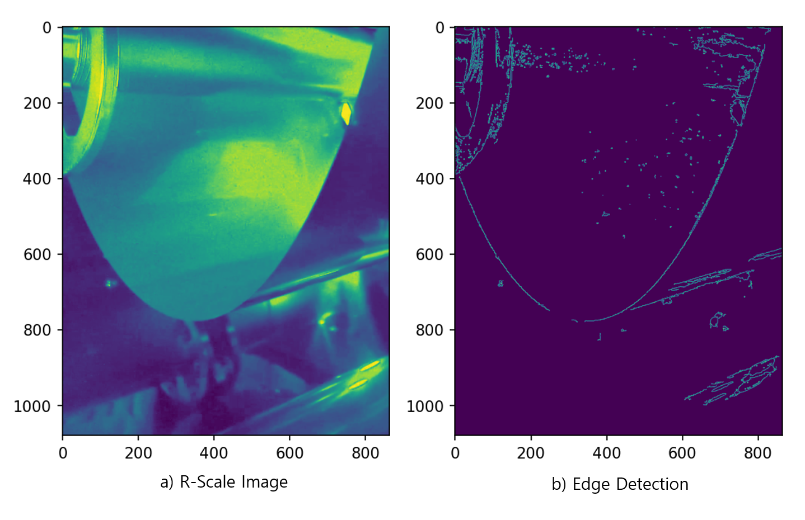

# LAB: Tension Detection of Rolling Metal Sheet


**Date:**  2025-May-7

**Author:**  Chanjung Kim  22000188

**Github:**  [Github_CJ](https://github.com/Chanjung-K/DLIP/tree/main/LAB/Tension%20Detection%20of%20Rolling%20Metal%20Sheet)

**Demo Video:** [YouTube](https://youtu.be/uFsaG7R9NFw)

---


# Introduction
## 1. Objective
​	This is a simplified industrial problem for designing a machine vision system that can detect the level of tension in the rolling metal sheet. The tension in the rolling process can be derived by measuring the curvature level of the metal sheet with the camera.

​	The surface of the chamber and the metal sheet are both specular reflective that can create virtual objects in the captured images. The design of a series of machine vision algorithms to clearly detect the edge of the metal sheet and derive the curvature and tension level is needed.	

**Goal**: Develop a machine vision algorithm to detect the tension level.

<hr>

## 2. Preparation

### Software Installation

- Visual Studio code
- opencv-python
- numpy
- matplotlib

### Video Sample

​	A Video is a challenging dataset, which can be downloaded by link below.

**Sample #1:** [Download](https://github.com/ykkimhgu/DLIP-src/blob/1d4183c65fb41d2ed5bf093c526c7ef49afa2d8e/LAB_Tension_Detection_dataset/Challenging_Dataset.zip)


<hr>


# Algorithm

​	In this section, an overview and detailed procedure of the algorithm used to implement the machine vision are introduced.

## 1. Overview

​	Since the industrial environment is predominantly colored red, selecting the region of interest (ROI) and splitting the three color channels was necessary. Additionally, an HSV in-range strategy was applied to segment the abnormal regions, especially in upper part.

​	To detect the edges, the Canny edge detector was applied, while morphology and contour detection play significant roles in eliminating noise. Filtered points are then selected and fitted with a second-order polynomial function. Based on the fitted function, the curvature score and convexity level are determined and eventually displayed beside the machine. The overall flowchart is displayed in **Figure 1** below.  

<figure style = "text-align : Center">
	
    <figCaption style = "text-align : center; font-size:20px"><b>Figure 1. Alogorithm Overview</b></figCaption>
</figure>

<hr>


## 2. Procedure

​	This section describes the key steps of the algorithm in detail, including channel splitting, HSV range setting, filtering, polynomial fitting, and text generation.

### 2-1. Splitting BGR to B, G, R scale

​	The industry environment is generally composed of red color, which required splitting. **Figure 2** illustrates the differences between each scale.

<figure style = "text-align : Center">
        
    <figCaption style = "text-align : center; font-size:20px"><b>Figure 2. Differences Depending on Scale</b></figCaption>
</figure>

### 2-2. HSV range and InRange Function

​	The original images contain white areas, which act as disturbances during edge detection. Therefore, the ROI image is converted into the HSV color space to determine a range for detecting abnormal regions. The HSV range is set as follows:

```python
lower_b = np.array([0, 0, 150]); 
upper_b = np.array([255, 230, 255]); 
```

​	 **Figure 3** shows result after applying ``InRange()`` function, which effectively detects the wheel and white region. The image in **Figure 3 - b** will be used in extracting edge noise.

<figure style = "text-align : Center">
        
    <figCaption style = "text-align : center; font-size:20px"><b>Figure 3. InRange Effect</b></figCaption>
</figure>


<hr>

### 2-3. Canny Edge Detection

​	With a spitted image in **Figure 1 - d**, a canny edge detection was applied. The effect is well shown in **Figure 4** below. 

<figure style = "text-align : Center">
        
    <figCaption style = "text-align : center; font-size:20px"><b>Figure 4. Canny Edge Detection</b></figCaption>
</figure>


<hr>

### 2-4. Filtering (Subtraction and Morphology)

​	The unwanted edge data, as featured in **Figure 4 - b**, are filtered out to minimize their impacts. First, edge detected image is subtracted to InRange image in **Figure 3 - b**, which gives image in **Figure 5**. Subsequently ,morphological operations were taken to eliminate remaining noises. 

<figure style = "text-align : Center">
        
    <figCaption style = "text-align : center; font-size:20px"><b>Figure 5. Subtraction Effect</b></figCaption>
</figure>

​	By subtracting InRange image from edge image, noises located in upper part of image are eliminated as shown in **Figure 5**. The morphology applied to eliminate noises at lower part as in **Figure 6** below.

<figure style = "text-align : Center">
        
    <figCaption style = "text-align : center; font-size:20px"><b>Figure 6. Morphology Filter</b></figCaption>
</figure>

<hr>

### 2-5. Contours and ROI Elimination

​	Contours are also used, since dot noises are still remained. All the contours are found, and those contours with low area are not drawn in final filtered image. Also, pixels, which are out of ROI region, are eliminated. The final result is presented in **Figure 7** below. 

<figure style = "text-align : Center">
        
    <figCaption style = "text-align : center; font-size:20px"><b>Figure 7. Final Filter Result</b></figCaption>
</figure>


<hr>

### 2-6. PolyFit

​	All the pixels whose intensity is not zero are gathered and used to fit 2nd order function. To avoid wrong fitting, the coefficient range are selected in form of ``ax^2 + bx + c``.

```c
-0.00357 < a < -0.0028 && 250 < c < 400 + 50 * (Level-1)
```

​	The ``polyfit()`` result is shown in **Figure 8** below. 

<figure style = "text-align : Center">
        
    <figCaption style = "text-align : center; font-size:20px"><b>Figure 8. Convex Line</b></figCaption>
</figure>


<hr>

### 2-7 Text Generation

​	After convex line is drawn, its score and level is calculated and printed in image as shown in **Figure 9** below.

<figure style = "text-align : Center">
        
    <figCaption style = "text-align : center; font-size:20px"><b>Figure 9. Final Result</b></figCaption>
</figure>


<hr>

# Result and Discussion

​	This section presents the results obtained from two sample videos and provides a brief discussion regarding the output and observed behavior of the algorithm.

### 1. Result

​	The result of first sample is shown in **Video 1** below. If the video does not appear, please refer to following [link](img/Output1.mp4) to view a video.

<figure style = "text-align : Center">
    	<video controls width = "720"> 
            <source src = "img/Output1.mp4" type = "video/mp4">
		</video>
    	<figCaption style = "text-align : center; font-size:16px"><b>Video 1. Final Output</b></figCaption>
</figure>

​	The convex line are well found and its score and level are displayed in right side of metal sheet with a good performance.


<hr>
### 2. Discussion

​	The developed machine vision algorithm successfully detected the tension level of the rolling metal sheet, demonstrating good performance under challenging industrial conditions. However, several limitations and areas for future improvement were identified during the implementation and test.

​	Significant difficulties arose in removing noise due to strong reflections from the metal surface. Extensive morphological operations were required to improve edge clarity, but these operations considerably slowed down the processing speed. Despite these efforts, complete noise removal was not achieved. In some frames, residual noise affected the polynomial curve fitting, while in others, the left edge line disappeared entirely, preventing proper fitting. To mitigate the impact of these issues, predefined coefficient ranges were applied during the second-order polynomial fitting process, thereby enhancing robustness.

<figure style = "text-align : Center">
        
    <figCaption style = "text-align : center; font-size:20px"><b>Figure 10. Filter Limitation</b></figCaption>
</figure>

​	Nevertheless, constraining fitting parameters is only a partial solution. Future work should focus on developing faster and more accurate noise reduction methods to further improve system performance and reliability for real-time industrial applications.

<hr>


# Conclusion

​	In this project, a machine vision algorithm was successfully developed to detect the tension level in a rolling metal sheet by analyzing its curvature. Through a combination of color space transformations, edge detection, morphological filtering, and polynomial curve fitting, the system demonstrated the capability to extract meaningful features.

​	Despite the promising results, certain challenges were encountered, particularly related to noise removal and processing speed. Extensive morphological operations, while effective in improving edge clarity, significantly slowed down the system. Additionally, the necessity to constrain the polynomial fitting coefficients highlighted the limitations of the current noise filtering strategies.

​	Overall, the implemented algorithm lays a foundation for real-time tension monitoring systems. However, to achieve greater robustness and efficiency, future work should focus on developing advanced noise reduction techniques and optimizing the processing pipeline. Enhancements in these areas would enable more accurate and faster detection, further broadening the algorithm’s applicability in industrial settings.

---


# Appendix

#### A. Source code

```python
############################################################################
# @course 	Deep Learning and Image Processing - HGU
# @author	Chanjung Kim / 22000188
# @Created	2025-04-22 by CJKIM
# @Modified	2025-05-07 by CJKIM
# @brief	[DLIP] LAB for Tension Detection of Rolling Metal Sheet
############################################################################

import cv2 as cv
import numpy as np
import matplotlib as plt
from matplotlib import pyplot as ppt

# Video load
deo = cv.VideoCapture("LAB3_Video.mp4"); 
open, src = deo.read(); 
rows, cols, _ = src.shape; 
Output = cv.VideoWriter("Output#1.mp4", cv.CAP_PROP_FOURCC, 30.0, (cols, rows), True); 

if not open:
    print("Error: no video is opened"); 
    deo.release(); 
    exit(); 

if not Output.isOpened():
    print("Error: No writer is opened"); 
    Output.release(); 
    exit(); 
######################################## Parameter Definition ########################################
# rows, cols calcu
Lv2 = 250; Lv3 = 120; 
dst = np.zeros(src.shape, np.uint8); 
dst = cv.cvtColor(dst, cv.COLOR_RGB2GRAY); 
# fourcc = cv.fourcc(*'mp4v'); 


# roi setting
width = int(cols * 0.45); 
HStart= int(rows*0.37); 
HLimit = rows; Level = 0; 
alpha = 1.6; beta = [600, 1976]; 

# Inrange Parameter
lower_b = np.array([0, 0, 150]); 
upper_b = np.array([255, 230, 255]); 

# Morphology Kernel Size
k_3 = cv.getStructuringElement(cv.MORPH_RECT, (3,3)); k_5 = cv.getStructuringElement(cv.MORPH_RECT, (5,5)); 
k_6 = cv.getStructuringElement(cv.MORPH_RECT, (6,6)); k_7 = cv.getStructuringElement(cv.MORPH_RECT, (7,7)); 
k_13 = cv.getStructuringElement(cv.MORPH_RECT, (13,13)); 
RectKennelSize = 5; 
k_51 = cv.getStructuringElement(cv.MORPH_RECT, (5,1)); k_15 = cv.getStructuringElement(cv.MORPH_RECT, (1,RectKennelSize)); 
FirstInterval = True; 
count = 0; 

############################################### VIDEO ###############################################
while deo.isOpened():
    state, src = deo.read(); 
    if not state:
        break; 
    dst = np.zeros(src.shape, np.uint8); 

    # ROI Selection and Splitting
    roi = src[0:rows, 0:width]; 
    b, g, r = cv.split(roi); 

    # RGB --> HSV Conversion
    temp = cv.cvtColor(roi, cv.COLOR_RGB2HSV); 

    # Inrange White Color
    Inrange = cv.inRange(temp, lower_b, upper_b); 

    # Substraction r-Inrange is not permitted since most of intensity goes negative
    r_temp = np.zeros(r.shape, np.uint8); 
    for i in range(rows):
        for j in range(width): 
            if not (Inrange[i][j]):
                r_temp[i][j] = r[i][j]; 

    ############################ CANNY #############################
    canr = cv.Canny(r_temp, 50, 150); 

    ########################## morphology ##########################
    Inrange = cv.morphologyEx(Inrange, cv.MORPH_DILATE, k_3); 
    canr = cv.morphologyEx(canr, cv.MORPH_CLOSE, k_3); 
    r = np.subtract(canr, Inrange); 
    r = cv.morphologyEx(r, cv.MORPH_DILATE, k_51); 
    r = cv.morphologyEx(r, cv.MORPH_OPEN, k_15);    
    r = cv.morphologyEx(r, cv.MORPH_CLOSE, k_13); 
    r = cv.morphologyEx(r, cv.MORPH_OPEN, k_51); 
    _, r = cv.threshold(r, 100, 255, cv.THRESH_BINARY); 
    
    ########################### Contours ###########################
    contours,_ = cv.findContours(r, cv.RETR_LIST, cv.CHAIN_APPROX_SIMPLE); 
    for i in range (0, len(contours)):
        if cv.contourArea(contours[i]) < 300:
            continue; 
        cv.drawContours(dst, contours, i, (255,255,255), -1); 
    
    ######################## Eliminate Noise ########################
    for j in range(600, rows):
        xidx1 = int((j-beta[0])/alpha); 
        for i in range(xidx1):
            dst[j][i] = 0; dst[j][width - i] = 0; 

    ############################ PolyFit ############################
    y_sample, x_sample,_ = np.nonzero(dst[HStart:HLimit][:]); 
    y_sample += HStart; 
    model_poly = np.polyfit(x_sample, y_sample, 2); 

    if FirstInterval:
        model_prev = model_poly; 
        FirstInterval = False; 
    
    ####################### PolyFit Exception ########################
    if model_poly[0] > -0.0028 or model_poly[0] < -0.00357 or model_poly[2] < 250 or (model_poly[2] > 400 + 50* (Level-1)):        
        model_poly = model_prev; 
    else:
        model_prev = model_poly; 

    ########################## Point assign ##########################
    x = np.linspace(int(width*0.05), width, width - int(width*0.05)); 
    y = np.polyval(model_poly, x); 
    y = np.array(y[y > y[0]]).astype(np.int32); 
    x = np.array(x[0:y.size]).astype(np.int32); 

    ########################## Draw in src ###########################
    for i in range(len(x)):
        for j in range(-2, 2, 1):
            yidx = y[i]+j; xidx = x[i]+j; 
            # index exception
            if yidx > rows or yidx < 0 or xidx < 0 or xidx >= width: 
                continue; 
            src[yidx][xidx] = [0, 255, 0];  

    
    # ymax exception in a condition y is empty
    if y.size == 0:
        y_max = 0;   
    else:
        y_max = rows - np.max(y); 
    
    ##################### Figure out Score and Level  #####################
    if y_max < Lv3:
        HLimit = rows; 
        Level = 3; 
    elif (y_max < Lv2):
        HLimit = rows - Lv3; 
        Level = 2; 
    else:
        HLimit = rows - Lv2; 
        Level = 1; 
    
    ########################## Text Insertion  ##########################
    StrScore = "Score: " + str(y_max); 
    StrLevel = "Level: " + str(Level); 
    src = cv.putText(src, StrScore, (width+100, 200), cv.FONT_HERSHEY_PLAIN, 2.0, (255,255,255), 4); 
    src = cv.putText(src, StrLevel, (width+100, 240), cv.FONT_HERSHEY_PLAIN, 2.0, (255,255,255), 4); 

    # Output print
    cv.imshow("src", src); 

    # Uncomment to write the result
    # Output.write(src); 

    if cv.waitKey(30) == 27:
        break;  

deo.release(); 
Output.release(); 

cv.waitKey(); 
```

<hr>
